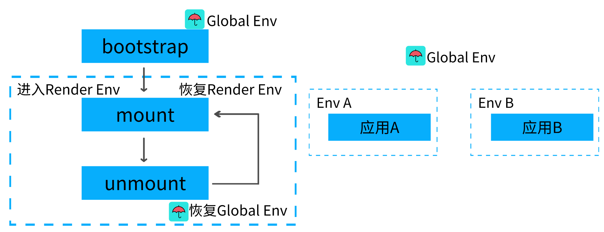

# 2020 年你必须要会的微前端 -（实战篇）

最近你有没有经常听到一个词？那就是微前端！ 感觉听上去非常的高大上！然而~

**微前端其实非常的简单，容易落地，而且也不高大上~**

## 一.为什么需要微前端?

我们通过 3W(what,why,how)的方式来讲解微前端

### What?什么是微前端?


微前端就是将不同的功能按照不同的维度拆分成多个子应用。通过主应用来加载这些子应用。

微前端的核心在于**拆**, 拆完后在**合**!

### Why?为什么去使用他?

- 不同团队间开发同一个应用技术栈不同怎么破？
- 希望每个团队都可以独立开发，独立部署怎么破？
- 项目中还需要老的应用代码怎么破？

我们是不是可以将一个应用划分成若干个子应用，将子应用打包成一个个的 lib。当路径切换时加载不同的子应用。这样每个子应用都是独立的，技术栈也不用做限制了！从而解决了前端协同开发问题

### How?怎样落地微前端?


2018 年 `Single-SPA`诞生了， `single-spa`是一个用于前端微服务化的 JavaScript 前端解决方案 (本身没有处理样式隔离，js 执行隔离) 实现了路由劫持和应用加载

2019 年 `qiankun`基于`Single-SPA`, 提供了更加开箱即用的 API （`single-spa` + `sandbox` + `import-html-entry`） 做到了，技术栈无关、并且接入简单（就像 iframe 一样简单）

> 总结：子应用可以独立构建，运行时动态加载,主子应用完全解耦，技术栈无关，靠的是协议接入（子应用必须导出 `bootstrap、mount、unmount`方法）

#### 这不是 iframe 吗？

- 如果使用 iframe，iframe 中的子应用切换路由时用户刷新页面就尴尬了。

#### 应用通信:

- 基于 URL 来进行数据传递，但是传递消息能力弱

- 基于 CustomEvent 实现通信

- 基于 props 主子应用间通信

- 使用全局变量、Redux 进行通信

#### 公共依赖:

- CDN - externals
- webpack 联邦模块

父子项目都加载一遍 Vue 或者 Vue-router，这时候就可以使用公共依赖`CDN`或者`webpack`联邦模块

## 二 .SingleSpa 实战

### 1.构建子应用

```bash
vue create spa-vue
npm install single-spa-vue
```

```js
import singleSpaVue from "single-spa-vue";
const appOptions = {
  el: "#vue",
  router,
  render: (h) => h(App),
};
// 在非子应用中正常挂载应用
if (!window.singleSpaNavigate) {
  delete appOptions.el;
  new Vue(appOptions).$mount("#app");
}
const vueLifeCycle = singleSpaVue({
  Vue,
  appOptions,
});
// 子应用必须导出 以下生命周期 bootstrap、mount、unmount
export const bootstrap = vueLifeCycle.bootstrap;
export const mount = vueLifeCycle.mount;
export const unmount = vueLifeCycle.unmount;
export default vueLifeCycle;
```

```js
const router = new VueRouter({
  mode: "history",
  // 配置子路由基础路径
  base: "/vue",
  routes,
});
```

### 2.配置库打包

```js
module.exports = {
  configureWebpack: {
    output: {
      // 将子模块打包成类库
      library: "singleVue",
      libraryTarget: "umd",
    },
    devServer: {
      port: 10000,
    },
  },
};
```

### 3.主应用搭建

```html
<div id="nav">
  <router-link to="/vue">vue项目</router-link>
  <!-- 将子应用挂载到id="vue"标签中 -->
  <div id="vue"></div>
</div>
```

```js
import Vue from "vue";
import App from "./App.vue";
import router from "./router";
import ElementUI from "element-ui";
import "element-ui/lib/theme-chalk/index.css";
Vue.use(ElementUI);
const loadScript = async (url) => {
  await new Promise((resolve, reject) => {
    const script = document.createElement("script");
    script.src = url;
    script.onload = resolve;
    script.onerror = reject;
    document.head.appendChild(script);
  });
};
import { registerApplication, start } from "single-spa";
registerApplication(
  "singleVue",
  async () => {
    await loadScript("http://localhost:10000/js/chunk-vendors.js");
    await loadScript("http://localhost:10000/js/app.js");
    return window.singleVue;
  },
  (location) => location.pathname.startsWith("/vue")
);
start();
new Vue({
  router,
  render: (h) => h(App),
}).$mount("#app");
```

### 4.动态设置子应用 publicPath

```js
if (window.singleSpaNavigate) {
  __webpack_public_path__ = "http://localhost:10000/";
}
```

## 三.qiankun 实战

### 1.主应用编写

```html
<el-menu :router="true" mode="horizontal">
  <el-menu-item index="/">首页</el-menu-item>
  <el-menu-item index="/vue">vue应用</el-menu-item>
  <el-menu-item index="/react">react应用</el-menu-item>
</el-menu>
<router-view v-show="$route.name"></router-view>
<div v-show="!$route.name" id="vue"></div>
<div v-show="!$route.name" id="react"></div>
```

### 2.注册子应用

```js
import { registerMicroApps, start } from "qiankun";
const apps = [
  {
    name: "vueApp",
    entry: "//localhost:10000",
    container: "#vue",
    activeRule: "/vue",
  },
  {
    name: "reactApp",
    entry: "//localhost:20000",
    container: "#react",
    activeRule: "/react",
  },
];
registerMicroApps(apps);
start();
```

### 3.子 Vue 应用

```js
let instance = null;
function render() {
  instance = new Vue({
    router,
    render: (h) => h(App),
  }).$mount("#app");
}
if (window.__POWERED_BY_QIANKUN__) {
  __webpack_public_path__ = window.__INJECTED_PUBLIC_PATH_BY_QIANKUN__;
}
if (!window.__POWERED_BY_QIANKUN__) {
  render();
}
export async function bootstrap() {}
export async function mount(props) {
  render();
}
export async function unmount() {
  instance.$destroy();
}
```

打包配置

```js
module.exports = {
  devServer: {
    port: 10000,
    headers: {
      "Access-Control-Allow-Origin": "*",
    },
  },
  configureWebpack: {
    output: {
      library: "vueApp",
      libraryTarget: "umd",
    },
  },
};
```

### 4.子 React 应用

```js
import React from "react";
import ReactDOM from "react-dom";
import "./index.css";
import App from "./App";
function render() {
  ReactDOM.render(
    <React.StrictMode>
      <App />
    </React.StrictMode>,
    document.getElementById("root")
  );
}
if (!window.__POWERED_BY_QIANKUN__) {
  render();
}
export async function bootstrap() {}
export async function mount() {
  render();
}
export async function unmount() {
  ReactDOM.unmountComponentAtNode(document.getElementById("root"));
}
```

#### 重写`react`中的`webpack`配置文件 (`config-overrides.js`)

```bash
yarn add react-app-rewired --save-dev
```

```js
module.exports = {
  webpack: (config) => {
    config.output.library = `reactApp`;
    config.output.libraryTarget = "umd";
    config.output.publicPath = "http://localhost:20000/";
    return config;
  },
  devServer: function (configFunction) {
    return function (proxy, allowedHost) {
      const config = configFunction(proxy, allowedHost);
      config.headers = {
        "Access-Control-Allow-Origin": "*",
      };
      return config;
    };
  },
};
```

#### 配置.env 文件

```config
PORT=20000
WDS_SOCKET_PORT=20000
```

#### React 路由配置

```jsx
import { BrowserRouter, Route, Link } from "react-router-dom";
const BASE_NAME = window.__POWERED_BY_QIANKUN__ ? "/react" : "";
function App() {
  return (
    <BrowserRouter basename={BASE_NAME}>
      <Link to="/">首页</Link>
      <Link to="/about">关于</Link>
      <Route path="/" exact render={() => <h1>hello home</h1>}></Route>
      <Route path="/about" render={() => <h1>hello about</h1>}></Route>
    </BrowserRouter>
  );
}
```

## 四.CSS 隔离方案

### 子应用之间样式隔离：

`Dynamic Stylesheet`动态样式表，当应用切换时移除老应用样式，添加新应用样式
主应用和子应用之间的样式隔离：

- `BEM`(`Block Element Modifier`) **约定**项目前缀
- `CSS-Modules` 打包时生成不冲突的选择器名
- `Shadow DOM` 真正意义上的隔离
- `css-in-js`(很少用)


#### shadow DOM 可以实现真正的隔离机制

```js
let shadowDom = shadow.attachShadow({ mode: "open" });
let pElement = document.createElement("p");
pElement.innerHTML = "hello world";
let styleElement = document.createElement("style");
styleElement.textContent = `
    p{color:red}
`;
shadowDom.appendChild(pElement);
shadowDom.appendChild(styleElement);
```

## 五.JS 沙箱机制



当运行子应用时应该跑在内部沙箱环境中

快照沙箱，在应用沙箱挂载或卸载时记录快照，在切换时依据快照恢复环境 (无法支持多实例)
Proxy 代理沙箱,不影响全局环境

### 1.快照沙箱

- 1.激活时将当前 window 属性进行快照处理

- 2.失活时用快照中的内容和当前 window 属性比对

- 3.如果属性发生变化保存到 modifyPropsMap 中，并用快照还原 window 属性

- 4.在次激活时，再次进行快照，并用上次修改的结果还原 window

```js
class SnapshotSandbox {
  constructor() {
    this.proxy = window;
    this.modifyPropsMap = {}; // 修改了那些属性
    this.active();
  }
  active() {
    this.windowSnapshot = {}; // window对象的快照
    for (const prop in window) {
      if (window.hasOwnProperty(prop)) {
        // 将window上的属性进行拍照
        this.windowSnapshot[prop] = window[prop];
      }
    }
    Object.keys(this.modifyPropsMap).forEach((p) => {
      window[p] = this.modifyPropsMap[p];
    });
  }
  inactive() {
    for (const prop in window) {
      // diff 差异
      if (window.hasOwnProperty(prop)) {
        // 将上次拍照的结果和本次window属性做对比
        if (window[prop] !== this.windowSnapshot[prop]) {
          // 保存修改后的结果
          this.modifyPropsMap[prop] = window[prop];
          // 还原window
          window[prop] = this.windowSnapshot[prop];
        }
      }
    }
  }
}
```

使用

```js
let sandbox = new SnapshotSandbox();
((window) => {
  window.a = 1;
  window.b = 2;
  window.c = 3;
  console.log(a, b, c);
  sandbox.inactive();
  console.log(a, b, c);
})(sandbox.proxy);
```

快照沙箱只能针对单实例应用场景,如果是多个实例同时挂载的情况则无法解决，这时候只能通过`proxy`代理沙箱来实现

### 2.Proxy

```js
class ProxySandbox {
  constructor() {
    const rawWindow = window;
    const fakeWindow = {};
    const proxy = new Proxy(fakeWindow, {
      set(target, p, value) {
        target[p] = value;
        return true;
      },
      get(target, p) {
        return target[p] || rawWindow[p];
      },
    });
    this.proxy = proxy;
  }
}
let sandbox1 = new ProxySandbox();
let sandbox2 = new ProxySandbox();
window.a = 1;
((window) => {
  window.a = "hello";
  console.log(window.a);
})(sandbox1.proxy);
((window) => {
  window.a = "world";
  console.log(window.a);
})(sandbox2.proxy);
```

这样每个应用都创建一个 `proxy` 来代理 `window`，好处是每个应用都是相对独立，不需要直接更改全局 `window` 属性！

TODO

`qiankun` 实战